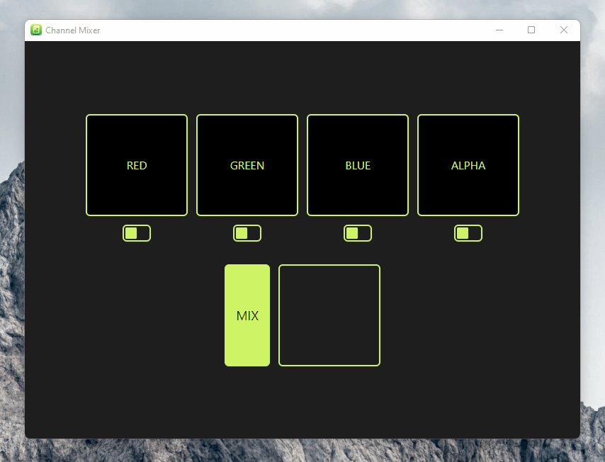

<p align="center">

</p>

<h1 align="center">Channel Mixer</h1>

## A simple and practical utility to mix grayscale textures into a single RGBA mask.

Have you ever had the need to transform multiple grayscale texture files into a single map, for use in a real-time engine? Then this App is for you.

<p align="center">

</p>

For example, imagine you have a material composed of Albedo, Roughness, Metallic, Normal, Ambient Occlusion (and many more, if needed). You could just import all those individual files in your real-time application (like Unity or Unreal Engine), and it works. But if you reduced the number of files, you would save drawcalls, which means more performance. But how can this be done without losing quality? Simple, by mixing channels.

Lets analyse: our Albedo texture is composed of 3 channels, R G and B. As is our Normal map. But our Roughness, Metallic and Ambient Occlusion are all grayscale textures, which means they only use 1 channel.

And there comes this App. We can just drag and drop our textures files into the appropriate slots, and then we can easily create a single file containing, for example, Roughness on Red channel, Metallic on Green channel and Ambient Occlusion on Blue channel. If there's another grayscale texture, like Bump for example, we could insert it in the Alpha slot too, totalling 4 channels (RGBA).

Now, in-engine we could setup our shader to make use of the individual channels, savind drawcalls in the end.

<p align="center">

</p>
<p align="center">

</p>

## Features

- Mix grayscale textures and create combined maps
- Up to 4 channels (RGBA)
- Drag and Drop behavior
- Also supports RGB textures*
- Supports non-square files (though they all have to be the same size)

*If you want, for example, just insert a custom Alpha texture into an existing colored texture (RGB) you could just drag you RGB texture 3 times, into each RGB slot. The Red slot will extract the red channel of your file, the Green will extract the green, and so on.

# For Developers

## Building locally
An environment variable called `RESOLVED_VERSION` is needed to create the artifact name during build. Create a file on root called `electron-builder.env` and add the following:

```
# Dummy version to be used by electron-builder when building locally
RESOLVED_VERSION=v0.0.0
```

## CI/CD

Every push on main and PR must pass the Code Inspection action. The PRs must have the title following the Conventional Commit style.

# Feeling generous? :D

<a href="https://www.buymeacoffee.com/leandrojunior" target="_blank"></a>
